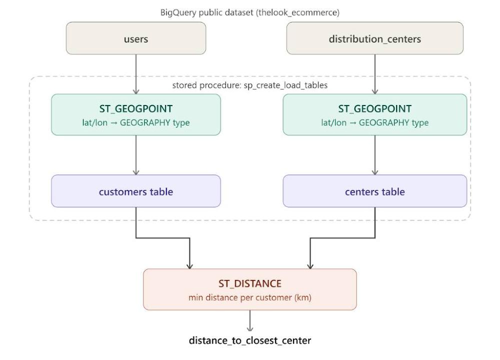

# Spatial SQL Pipeline: Customer-to-Hub Distance Analysis

**A logistics coverage pipeline built in BigQuery using geographic SQL functions and stored procedures**

> This project was completed as a structured lab exercise (Google Cloud Skills Boost: *Creating and Managing SQL Pipelines*). The SQL implementation follows the lab architecture. The analysis, limitations assessment, production architecture comparison, and commentary in this README are my own.

---

## Problem Statement

Delivery time is a direct driver of eCommerce customer retention. When customers are farther from distribution hubs than necessary, delivery windows suffer — and the business pays for it in churn, not just logistics costs.

The foundational question this pipeline answers: **how far is every customer from their nearest distribution center?**

That number feeds real operational decisions — whether to relocate a hub, open a new one, or adjust delivery route allocation — but only if the data is structured cleanly, calculated accurately, and refreshed regularly enough to reflect a growing customer base.

---

## Pipeline Architecture



---
```
┌─────────────────────────────────────────────────────────────────┐
│                    BigQuery Public Dataset                       │
│                                                                  │
│   distribution_centers              users                        │
│   (lat/lon as FLOAT64)              (lat/lon as FLOAT64)        │
└───────────────┬─────────────────────────┬───────────────────────┘
                │                         │
                ▼ ST_GEOGPOINT            ▼ ST_GEOGPOINT
┌───────────────────────┐    ┌────────────────────────┐
│   centers             │    │   customers            │
│   point_location      │    │   point_location       │
│   (GEOGRAPHY)         │    │   (GEOGRAPHY)          │
└───────────────┬───────┘    └──────────┬─────────────┘
                │                        │
                └──────────┬─────────────┘
                           │
                           ▼ ST_DISTANCE (scalar subquery)
              ┌────────────────────────────┐
              │   Minimum distance         │
              │   per customer · km        │
              └──────────────┬─────────────┘
                             │
                             ▼ Packaged into
              ┌────────────────────────────┐
              │  sp_create_load_tables     │
              │  (stored procedure)        │
              └──────────────┬─────────────┘
                             │
                             ▼
              ┌────────────────────────────┐
              │  distance_to_closest_      │
              │  center (km)               │
              │  one row per customer      │
              └────────────────────────────┘
```
---

## Key Transformations

### 1. Geographic Point Creation — `ST_GEOGPOINT`

Raw latitude and longitude are stored as `FLOAT64` columns. These are numbers — they carry no spatial meaning the database can reason about. The first transformation converts them into `GEOGRAPHY` point types:

```sql
ST_GEOGPOINT(longitude, latitude) AS point_location
```

**Note on argument order:** longitude comes first, then latitude. This matches the (x, y) convention in coordinate geometry — a common source of error that produces silent wrong answers, not an error message.

Applied to both source tables:

```sql
-- centers table
CREATE OR REPLACE TABLE `thelook_ecommerce.centers` AS
SELECT
  id,
  name,
  latitude,
  longitude,
  ST_GEOGPOINT(dcenters.longitude, dcenters.latitude) AS point_location
FROM `bigquery-public-data.thelook_ecommerce.distribution_centers` AS dcenters;

-- customers table
CREATE OR REPLACE TABLE `thelook_ecommerce.customers` AS
SELECT
  id,
  first_name,
  last_name,
  latitude,
  longitude,
  ST_GEOGPOINT(users.longitude, users.latitude) AS point_location
FROM `bigquery-public-data.thelook_ecommerce.users` AS users;
```

---

### 2. Minimum Distance Calculation — `ST_DISTANCE`

A scalar subquery calculates the geodesic distance between each customer's location and every distribution center, returning only the minimum. The result is divided by 1000 to convert meters to kilometers:

```sql
SELECT
  customers.id AS customer_id,
  (
    SELECT MIN(ST_DISTANCE(centers.point_location, customers.point_location)) / 1000
    FROM `thelook_ecommerce.centers` AS centers
  ) AS distance_to_closest_center
FROM `thelook_ecommerce.customers` AS customers;
```

For each customer row, the subquery scans every distribution center, calculates the distance to each, and returns only the minimum. One row per customer. One number per row.

`ST_DISTANCE` returns geodesic distance — the shortest path between two points on the earth's surface — not road distance. This distinction matters for the limitations section below.

---

### 3. Stored Procedure — Pipeline Packaging

A single query answers a single question. What a logistics team needs is a system that executes the full sequence on demand, absorbs schema changes in one place, and can be scheduled for regular refresh.

The stored procedure wraps every step — table creation, data ingestion, geographic transformation — into one callable unit:

```sql
CREATE OR REPLACE PROCEDURE `thelook_ecommerce.sp_create_load_tables`()
BEGIN
  -- table definitions
  -- data ingestion from public dataset
  -- geographic transformations (ST_GEOGPOINT applied to both tables)
END;
```

**Why this matters:** when schemas change — a new column is added, a source table is restructured — one update to the procedure propagates through the entire pipeline. One call schedules the full sequence. This is the difference between a script and infrastructure.

See [`sql/05_stored_procedure.sql`](sql/05_stored_procedure.sql) for the complete implementation.

---

## Output

The pipeline produces a table with one row per customer and one value of interest: `distance_to_closest_center` in kilometers.

> **Screenshot:** Results table showing `customer_id` and `distance_to_closest_center` — add your own from the BigQuery results pane.

---

## My Analysis

### What this pipeline does well

The stored procedure pattern handles the core requirements cleanly: it is repeatable, separates table definitions from ingestion logic, and can be scheduled. For a single-warehouse, single-team environment working from a stable source dataset, it is entirely fit for purpose.

The spatial functions — `ST_GEOGPOINT` and `ST_DISTANCE` — are precise and well-suited to the problem. Geographic distance calculation at scale is non-trivial to implement from scratch; having it available as a native function is not a small thing.

---

### Limitations

**Geodesic distance, not road distance.**
`ST_DISTANCE` calculates the straight-line distance between two points on the earth's surface. For logistics planning, what actually matters is travel time and road distance. A customer 80km from a hub across flat motorway terrain is operationally closer than one 60km away separated by mountain roads. This pipeline answers the geometric question accurately; it does not answer the operational one. A production version would integrate a routing API (Google Maps Distance Matrix, HERE Maps) to return actual travel time and road distance.

**No historical tracking.**
The `CREATE OR REPLACE` pattern overwrites every table on every run. There is no record of how the distance landscape changes over time — as the customer base grows into new regions, or as new hubs open. A pipeline that can only answer "what is the distance today" cannot answer "has coverage improved since last quarter." A production version would append records with run timestamps and use incremental loading.

**No error handling.**
If one step inside the stored procedure fails, there is no rollback. The procedure leaves tables in whatever state they were in when the failure occurred. In production, this creates inconsistent data states that are difficult to detect and debug. dbt and Airflow both provide native failure handling, retry logic, and alerting.

**No data quality checks.**
The pipeline ingests whatever the source tables contain. There is no validation that latitude and longitude values are within valid ranges (latitude must be -90 to 90, longitude -180 to 180), no check for duplicate customer IDs, no assertion that the join between orders and products produces no fan-out. Silent data quality failures are the most dangerous kind in a pipeline — they produce wrong answers that look like right ones.

**Scalar subquery performance ceiling.**
The current approach scans every distribution center for every customer row. At this dataset's scale, that is acceptable. At millions of customers and hundreds of distribution centers, spatial indexing, partitioned tables, and approximate nearest-neighbor algorithms become necessary. BigQuery supports spatial indexing via `GEOGRAPHY` clustering; a production version would use it.

---

### What a production version looks like

| Component | This pipeline | Production equivalent |
|---|---|---|
| Extraction | `SELECT` from BigQuery public dataset | Airbyte connectors from ERP, CRM, WMS systems |
| Storage | BigQuery tables | Snowflake with role-based access control |
| Transformation | Stored procedure | dbt models with version control and automated testing |
| Scheduling | BigQuery scheduled queries | Airflow or Prefect DAGs with failure alerting |
| Distance method | `ST_DISTANCE` (geodesic) | Routing API (travel time, road distance) |
| History | Full refresh — no history | Incremental models with timestamps |
| Data quality | None | dbt tests: `not_null`, `unique`, `accepted_values` |

---

### What dbt handles differently

The stored procedure and a dbt model solve the same core problem: making transformations repeatable and updateable. The difference is in maintenance properties.

dbt models are plain `.sql` files in a git repository. Every change is versioned, reviewable, and revertible. dbt's test framework runs assertions automatically — checking for null values, duplicate keys, referential integrity — before any transformation lands in production. dbt docs generates a data catalog and lineage graph automatically, so anyone joining the team can trace where a column comes from without reading the procedure source.

A stored procedure achieves none of this without significant manual discipline. It is not the wrong tool — it is the right tool for what it is. Understanding the gap between the two is how you reason about which one a given environment actually needs.

---

### What I would build next

1. **Regional coverage aggregation** — average distance to nearest hub by state, surfacing which regions are systematically underserved by the current hub network.

2. **Underserved customer flag** — a boolean column marking customers beyond a defined threshold distance (e.g., 500km from any hub), enabling the logistics team to quantify the at-risk segment directly.

3. **Distance-to-delivery-time correlation** — joining this output to actual delivery performance data to test whether geographic distance is the primary driver of delivery delays, or whether warehouse throughput and carrier reliability dominate.

4. **Incremental loading pattern** — replace full refresh with append-and-timestamp, enabling longitudinal coverage analysis and trend detection as the customer base grows.

---

## Tech Stack

- **BigQuery** — SQL execution, native spatial functions, stored procedures
- **SQL** — `ST_GEOGPOINT`, `ST_DISTANCE`, scalar subqueries, `CREATE OR REPLACE PROCEDURE`
- **Source data** — TheLook eCommerce public dataset (Google Cloud)

---

## Repository Structure

```
spatial-sql-pipeline/
├── README.md
├── sql/
│   ├── 01_create_schemas.sql        -- Empty table definitions
│   ├── 02_load_centers.sql          -- Centers table with ST_GEOGPOINT
│   ├── 03_load_customers.sql        -- Customers table with ST_GEOGPOINT
│   ├── 04_distance_query.sql        -- ST_DISTANCE scalar subquery
│   └── 05_stored_procedure.sql      -- Complete stored procedure
└── assets/
    └── pipeline_results.png         -- Screenshot of output table
```

---

## Context

Built as part of a self-directed transition into data engineering. Background in healthcare insurance operations and biochemistry — both fields where the distance between what data says and what decisions get made determines whether people are served well or not. The logistics version of that problem is structurally identical.
